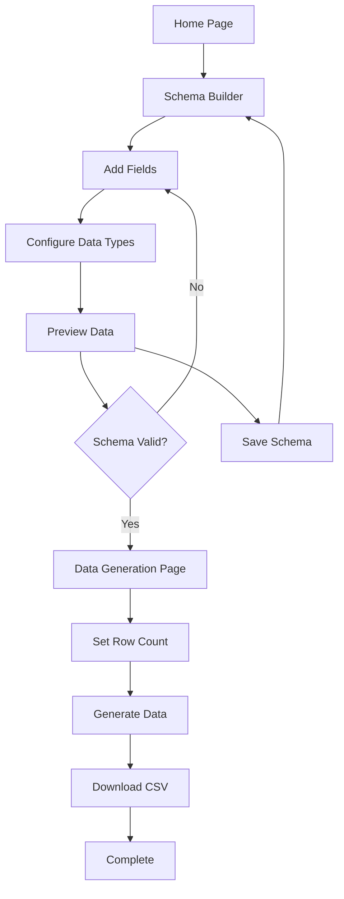

# DataForge - Product Requirements Document

## 1. Product Overview

DataForge is a client-side data generation tool that creates realistic CSV test data for database testing and development purposes. The application runs entirely in the browser using React and Go WebAssembly, eliminating the need for server infrastructure while providing powerful data generation capabilities.

The tool addresses the critical need for realistic test data in software development, helping developers populate databases with varied, realistic data that closely simulates production environments. By running client-side, it ensures data privacy and provides instant access without API limitations.

## 2. Core Features

### 2.1 User Roles

| Role | Registration Method | Core Permissions |
|------|---------------------|------------------|
| Anonymous User | No registration required | Can create schemas, generate up to 10,000 rows, download CSV files |

### 2.2 Feature Module

Our DataForge consists of the following main pages:

1. **Home Page**: Hero section with tool introduction, quick start guide, and navigation to schema builder
2. **Schema Builder Page**: Interactive schema creation interface, field configuration, data type selection, and preview functionality
3. **Data Generation Page**: Progress tracking, generation controls, and download interface

### 2.3 Page Details

| Page Name | Module Name | Feature description |
|-----------|-------------|---------------------|
| Home Page | Hero Section | Display tool benefits, key features, and call-to-action to start creating schemas |
| Home Page | Quick Start Guide | Show step-by-step process: create schema → configure fields → generate data → download CSV |
| Home Page | Navigation Header | Provide access to schema builder, documentation, and GitHub repository |
| Schema Builder | Field Manager | Add, remove, reorder fields with drag-and-drop interface |
| Schema Builder | Data Type Selector | Choose from 50+ data types including names, emails, addresses, numbers, dates, custom lists |
| Schema Builder | Field Configuration | Set field-specific options like format, range, locale, and custom parameters |
| Schema Builder | Schema Preview | Display sample data based on current schema configuration (5-10 rows) |
| Schema Builder | Schema Actions | Save schema locally, load saved schemas, export/import schema definitions |
| Data Generation | Generation Controls | Set number of rows (1-10,000), select output format (CSV), initiate generation |
| Data Generation | Progress Tracking | Show real-time progress bar, estimated time remaining, and generation status |
| Data Generation | Download Interface | Provide download button for generated CSV file, show file size and row count |

## 3. Core Process

**Main User Flow:**
1. User visits the home page and clicks "Create Schema"
2. User adds fields to their schema by specifying field names and selecting data types
3. User configures each field's options (format, range, custom values)
4. User previews sample data to verify schema correctness
5. User sets the number of rows to generate (1-10,000)
6. User clicks "Generate Data" to start the WebAssembly data generation process
7. User downloads the generated CSV file once processing is complete

## 4. User Interface Design

### 4.1 Design Style

- **Primary Colors**: Blue (#3B82F6) for primary actions, Gray (#6B7280) for secondary elements
- **Secondary Colors**: Green (#10B981) for success states, Red (#EF4444) for errors, Yellow (#F59E0B) for warnings
- **Button Style**: Rounded corners (8px), solid fills for primary actions, outlined for secondary actions
- **Font**: Inter font family, 14px base size, 16px for headings, 12px for labels
- **Layout Style**: Clean card-based design with generous white space, left sidebar navigation in schema builder
- **Icons**: Heroicons for consistency, drag handles for reorderable lists, data type icons for visual recognition

### 4.2 Page Design Overview

| Page Name | Module Name | UI Elements |
|-----------|-------------|-------------|
| Home Page | Hero Section | Large heading, subtitle, gradient background, prominent CTA button, feature highlights with icons |
| Home Page | Quick Start Guide | Numbered steps with icons, visual flow diagram, example schema preview |
| Schema Builder | Field Manager | Spreadsheet-like table, drag handles, add/remove buttons, field type dropdowns |
| Schema Builder | Data Type Selector | Categorized dropdown with search, type descriptions, option panels |
| Schema Builder | Preview Panel | Mini table showing sample data, refresh button, row count indicator |
| Data Generation | Progress Section | Circular progress indicator, status text, cancel button, time estimates |
| Data Generation | Download Section | Large download button, file info card, success animation |

### 4.3 Responsiveness

The application is desktop-first with mobile-adaptive design. The schema builder uses a responsive table that collapses to cards on mobile devices. Touch interactions are optimized for mobile field configuration and drag-and-drop operations.