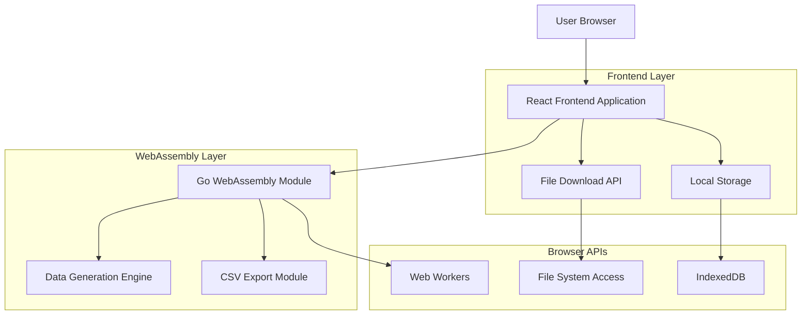
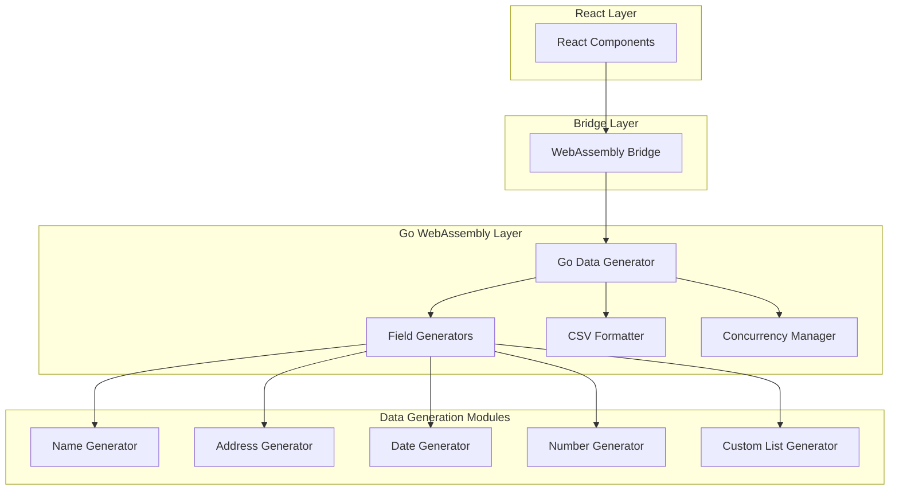
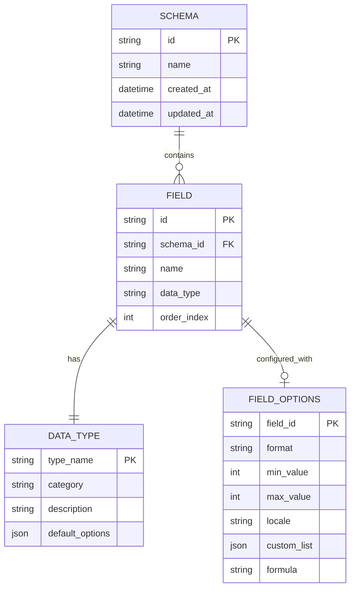

# MockData Generator - Technical Architecture Document

## 1. Architecture Design



## 2. Technology Description

* Frontend: React\@18 + TailwindCSS\@3 + Vite + TypeScript

* Backend: Go\@1.21+ compiled to WebAssembly

* Build Tools: Vite for React bundling, Go compiler for WASM generation

* Storage: Browser LocalStorage for schema persistence

* File Handling: Browser File API for CSV downloads

## 3. Route Definitions

| Route     | Purpose                                                                |
| --------- | ---------------------------------------------------------------------- |
| /         | Home page with hero section and quick start guide                      |
| /builder  | Schema builder interface for creating and configuring data schemas     |
| /generate | Data generation page with progress tracking and download functionality |

## 4. API Definitions

### 4.1 WebAssembly Interface

**Data Generation Function**

```go
//export generateData
func generateData(schemaJSON string, rowCount int) string
```

Request Parameters:

| Param Name | Param Type | isRequired | Description                                                 |
| ---------- | ---------- | ---------- | ----------------------------------------------------------- |
| schemaJSON | string     | true       | JSON string containing field definitions and configurations |
| rowCount   | int        | true       | Number of rows to generate (1-10000)                        |

Response:

| Param Name | Param Type | Description                  |
| ---------- | ---------- | ---------------------------- |
| csvData    | string     | Generated CSV data as string |

**Schema Validation Function**

```go
//export validateSchema
func validateSchema(schemaJSON string) string
```

Request Parameters:

| Param Name | Param Type | isRequired | Description                              |
| ---------- | ---------- | ---------- | ---------------------------------------- |
| schemaJSON | string     | true       | JSON string containing schema definition |

Response:

| Param Name       | Param Type | Description                                   |
| ---------------- | ---------- | --------------------------------------------- |
| validationResult | string     | JSON string with validation status and errors |

**Preview Data Function**

```go
//export previewData
func previewData(schemaJSON string) string
```

Request Parameters:

| Param Name | Param Type | isRequired | Description                              |
| ---------- | ---------- | ---------- | ---------------------------------------- |
| schemaJSON | string     | true       | JSON string containing schema definition |

Response:

| Param Name  | Param Type | Description                    |
| ----------- | ---------- | ------------------------------ |
| previewData | string     | JSON string with 5 sample rows |

### 4.2 TypeScript Type Definitions

```typescript
interface DataField {
  id: string;
  name: string;
  type: DataType;
  options: FieldOptions;
}

interface Schema {
  id: string;
  name: string;
  fields: DataField[];
  createdAt: Date;
  updatedAt: Date;
}

interface FieldOptions {
  format?: string;
  min?: number;
  max?: number;
  locale?: string;
  customList?: string[];
  formula?: string;
}

enum DataType {
  FIRST_NAME = 'first_name',
  LAST_NAME = 'last_name',
  EMAIL = 'email',
  PHONE = 'phone',
  ADDRESS = 'address',
  CITY = 'city',
  COUNTRY = 'country',
  DATE = 'date',
  NUMBER = 'number',
  BOOLEAN = 'boolean',
  UUID = 'uuid',
  CUSTOM_LIST = 'custom_list'
}

interface GenerationProgress {
  rowsGenerated: number;
  totalRows: number;
  percentage: number;
  estimatedTimeRemaining: number;
  status: 'idle' | 'generating' | 'complete' | 'error';
}
```

## 5. Server Architecture Diagram



## 6. Data Model

### 6.1 Data Model Definition



### 6.2 Local Storage Schema

**Schema Storage (LocalStorage)**

```javascript
// Key: 'mockdata_schemas'
// Value: JSON array of Schema objects
[
  {
    "id": "uuid-v4",
    "name": "User Table Schema",
    "fields": [
      {
        "id": "field-uuid-1",
        "name": "first_name",
        "type": "first_name",
        "options": {
          "locale": "en"
        }
      },
      {
        "id": "field-uuid-2",
        "name": "email",
        "type": "email",
        "options": {
          "format": "standard"
        }
      }
    ],
    "createdAt": "2024-01-15T10:30:00Z",
    "updatedAt": "2024-01-15T11:45:00Z"
  }
]
```

**User Preferences (LocalStorage)**

```javascript
// Key: 'mockdata_preferences'
// Value: JSON object with user settings
{
  "defaultRowCount": 1000,
  "preferredLocale": "en",
  "theme": "light",
  "lastUsedSchema": "uuid-v4"
}
```

## 7. WebAssembly Integration Details

### 7.1 Go to JavaScript Bridge

```go
package main

import (
    "encoding/json"
    "syscall/js"
)

func main() {
    js.Global().Set("generateData", js.FuncOf(generateDataWrapper))
    js.Global().Set("validateSchema", js.FuncOf(validateSchemaWrapper))
    js.Global().Set("previewData", js.FuncOf(previewDataWrapper))
    
    // Keep the program running
    select {}
}

func generateDataWrapper(this js.Value, args []js.Value) interface{} {
    schemaJSON := args[0].String()
    rowCount := args[1].Int()
    
    result := generateData(schemaJSON, rowCount)
    return js.ValueOf(result)
}
```

### 7.2 Concurrency Implementation

```go
func generateDataConcurrent(schema Schema, rowCount int) [][]string {
    numWorkers := runtime.NumCPU()
    if numWorkers > 4 {
        numWorkers = 4 // Limit for WebAssembly
    }
    
    rowsPerWorker := rowCount / numWorkers
    results := make(chan [][]string, numWorkers)
    
    for i := 0; i < numWorkers; i++ {
        go func(start, count int) {
            workerData := generateRows(schema, start, count)
            results <- workerData
        }(i*rowsPerWorker, rowsPerWorker)
    }
    
    // Collect results
    var allData [][]string
    for i := 0; i < numWorkers; i++ {
        workerData := <-results
        allData = append(allData, workerData...)
    }
    
    return allData
}
```

### 7.3 Memory Management

```go
// Implement memory-efficient streaming for large datasets
func generateLargeDataset(schema Schema, rowCount int) string {
    var csvBuilder strings.Builder
    csvBuilder.Grow(rowCount * 100) // Pre-allocate estimated size
    
    // Write header
    writeCSVHeader(&csvBuilder, schema)
    
    // Generate data in chunks to manage memory
    chunkSize := 1000
    for i := 0; i < rowCount; i += chunkSize {
        remaining := rowCount - i
        if remaining > chunkSize {
            remaining = chunkSize
        }
        
        chunk := generateRows(schema, i, remaining)
        writeCSVChunk(&csvBuilder, chunk)
        
        // Force garbage collection periodically
        if i%5000 == 0 {
            runtime.GC()
        }
    }
    
    return csvBuilder.String()
}
```

